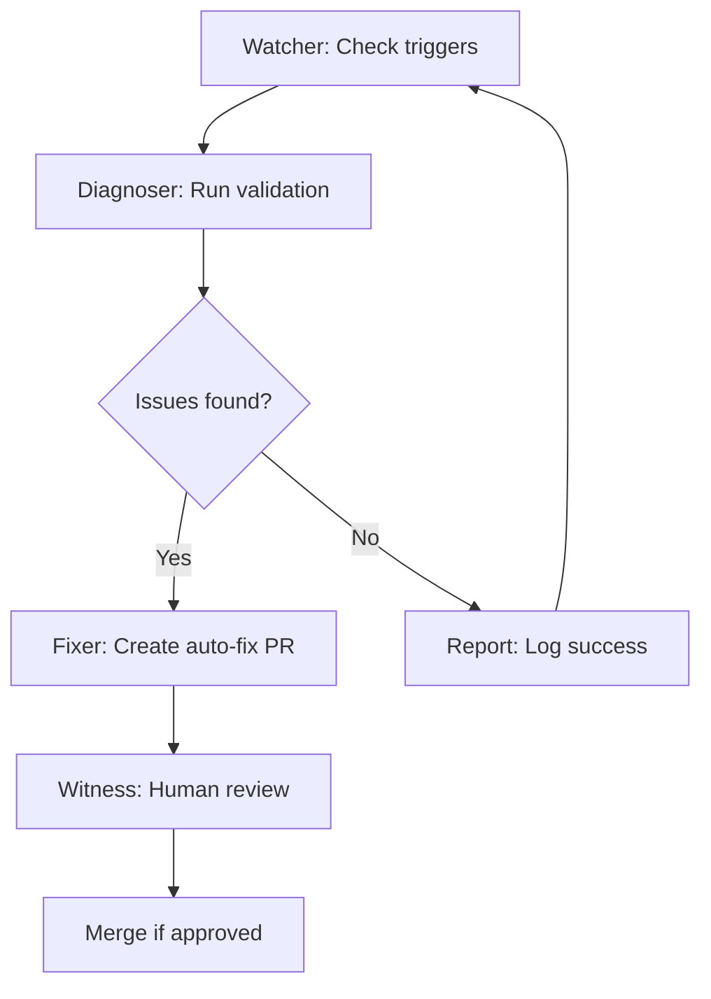

# The Coherence Loop

## Overview

The Coherence Loop is a recursive self-improvement system for **The Fold Within Earth** website. It continuously monitors, diagnoses, and automatically fixes coherence issues in the site's content and infrastructure.

## How It Works

### 1. Watcher - GitHub Actions Monitoring
The system uses GitHub Actions to monitor site health on multiple schedules:
- **Every 4 hours**: Full coherence validation
- **Daily at midnight**: Comprehensive report generation
- **On push/PR**: Validation of changes

### 2. Diagnoser - Automated Issue Identification
The diagnostic layer checks:
- **Frontmatter completeness**: Validates required fields in all fieldnotes
- **Metadata integrity**: Ensures metadata.yaml files are valid and complete
- **Link coherence**: Detects broken internal and external links
- **File structure**: Verifies content follows expected patterns

### 3. Fixer - Auto-Patching Common Issues
When issues are tagged with `needs-auto-fix`, the system can:
- Add missing frontmatter templates
- Fix metadata formatting issues
- Regenerate index files
- Create pull requests with fixes

### 4. Witness - Human Review Validation
Human reviewers validate improvements through:
- Pull request reviews
- Issue triage
- Project board management
- Discussion participation

## Cycles

### Automated Cycle (Every 4 Hours)

### Daily Cycle (Midnight)
1. Generate comprehensive coherence report
2. Post to GitHub Discussions
3. Update project board with new issues
4. Archive completed items

### Weekly Cycle (Full Review)
1. Review all open PRs
2. Audit project board columns
3. Update documentation
4. Refine automation rules

## Roles

| Role | Actor | Responsibilities |
|------|-------|-------------------|
| **Developer** | GitHub Actions | Automated checks, fixes, reporting |
| **Tester** | Automated scripts | Validation, link checking, schema verification |
| **User** | Community members | Issue reporting, feedback |
| **Witness** | Human reviewers | PR review, triage, quality assurance |

## Metrics

The system tracks:
- **Coherence Score**: Overall site health (0-100)
- **Issue Density**: Issues per content file
- **Fix Rate**: Automated vs manual fixes
- **Response Time**: Time from issue to resolution

## Configuration

### Workflow Files
- `.github/workflows/coherence-check.yml` - Primary validation
- `.github/workflows/auto-fix.yml` - Automated fixes
- `.github/workflows/daily-report.yml` - Daily reporting

### Scripts
- `tools/coherence-check.py` - Main validation script
- `tools/generate-index.mjs` - Index generation with validation

### Templates
- `docs/fieldnote-template.md` - Frontmatter template
- `docs/coherence-system.md` - This documentation

## Getting Started

### Reporting Issues
1. Use the "Coherence Issue" template
2. Select the appropriate error type and severity
3. Provide clear reproduction steps

### Contributing Fixes
1. Fork the repository
2. Create a feature branch
3. Make your changes
4. Run `python tools/coherence-check.py` locally
5. Submit a PR

## Support

- **Documentation**: See `docs/` folder
- **Discussions**: Use GitHub Discussions
- **Issues**: Open a GitHub issue
